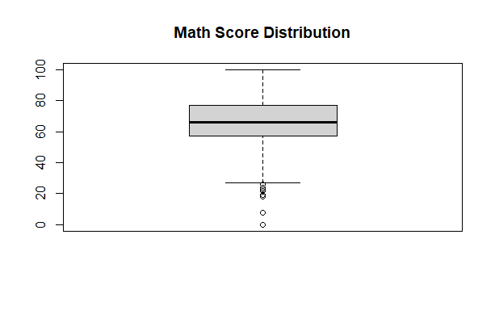

# Students Performance Analysis (RStudio)

📌 Project Overview
This project performs Exploratory Data Analysis (EDA) and Feature Engineering on the Students Performance in Exams dataset using RStudio. The objective is to analyze academic performance patterns, identify influencing factors, and derive statistical insights strictly using R.

🛠 Tools Used
-RStudio
-Base R functions
-Statistical analysis & visualization

📂 Dataset
Students Performance in Exams Dataset
Source: Kaggle
Observations: 1000
Variables: 8

🔍 Analysis Performed
-Data import and structure analysis
-Missing value check
-Data type transformation (Character → Factor)
-Outlier detection using boxplots
-Feature engineering (Total Score, Average Score, Performance Band)
-Correlation analysis
-Test preparation impact analysis

📈 Key Insights
-Strong correlation between reading and writing scores (0.95)
-Test preparation increases average score by ~7.6 marks
-Majority of students fall in the “Average” performance band (444 students)
-Math scores show higher variability compared to other subjects

## 📊 Math Score Distribution

📌 Conclusion
The analysis demonstrates that structured preparation and academic support significantly improve student performance. Literacy-based subjects are strongly interconnected, and targeted strategies can help reduce performance variability, particularly in mathematics.
